# Performance Analysis of Clustering and Classification Methods on Wine Quality

## Project Proposal

The Wine Quality dataset measures the quality of various red and white Vinho Verde wines from northern Portugal. The dataset consists of 11 continuous physicochemical measurements for 6497 samples in total with features like fixed acidity, volatile acidity, citric acid, residual sugar, chlorides, and alcohol content. The goal is to model and predict the value of the quality score, where the score is a label between 0 and 10 for each wine determined by these measurable properties. Two methods of approaching this predictive modelling task are classification (categorizing wines into quality classes) and regression (estimating the exact quality score).

The problem addressed here lies at a point where other studies also address the quality assessment of wine, which provides the context in which accurately predicting wine quality can be useful to winemakers to optimize for quality. Further, a knowledge of how physicochemical attributes relate to perceived quality can aid quality control and help product development. There are two reasons why this is a challenge: the dataset is multivariate with unbalanced quality classes; thus a robust set of models is needed for handling feature relevance, outlier detection and class imbalance to provide high-quality predictions.

## EDA

Scattered distributions and outliers in the features of residual sugar and chlorides were observed in the histograms, which suggested potential transformations for these features to have less influence on models.

Class imbalance in the target variable (most wines rated in the middle range) was displayed and therefore with one or more of the resampling techniques or algorithms that are robust to an imbalanced data. The correlation matrix and heatmap highlighted high multicollinearity between total_sulphur_dioxide and free_sulphur_dioxide, which could have an impact on model stability. The analysis found positive correlations between wine quality and alcohol, citric acid, and sulphates, and negative correlations between volatile acidity, chlorides and density.

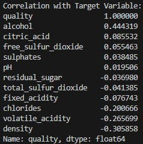

Figure 1: Correlation of Features with Target Variable

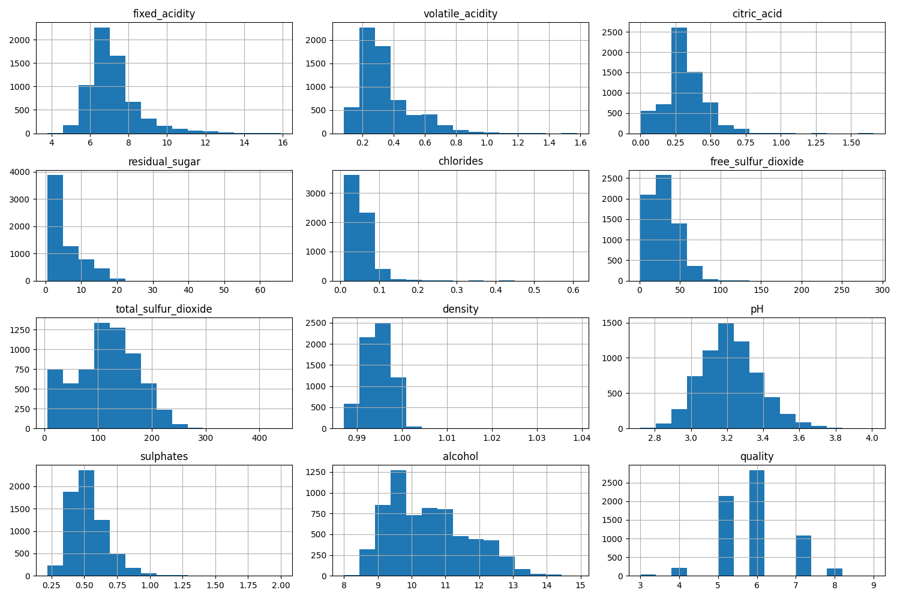

Figure 2: Quantity of Samples for Each Feature

Outliers confirmed by box plots were present in several features, leading to decisions on whether to remove or transform them. Pair plots were used to visualize relationships between features and the target variable so we could see some feature pairs that might separate higher vs. lower quality wines and help with feature selection and engineering during modelling. Below is a graph for the correlation heatmap visualization.

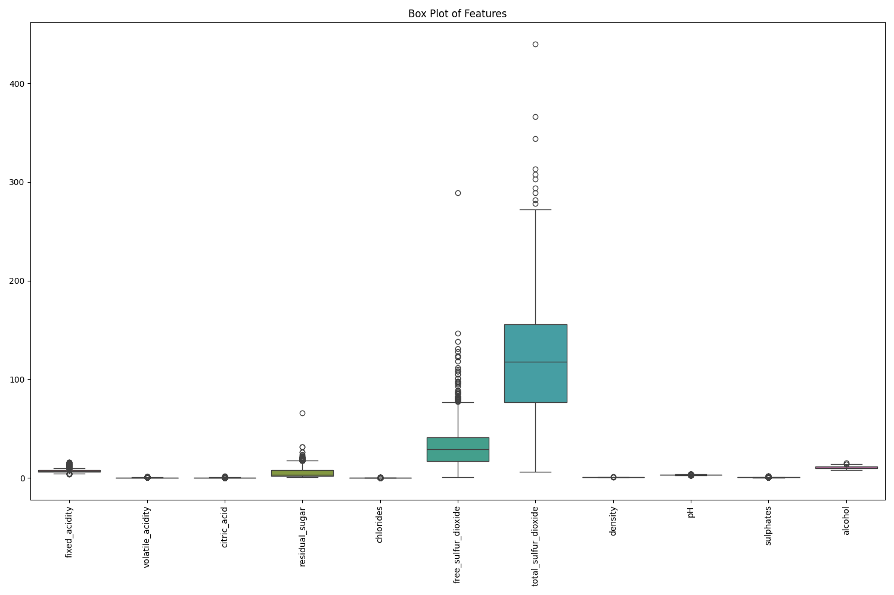

Figure 3: Box Plot of Features

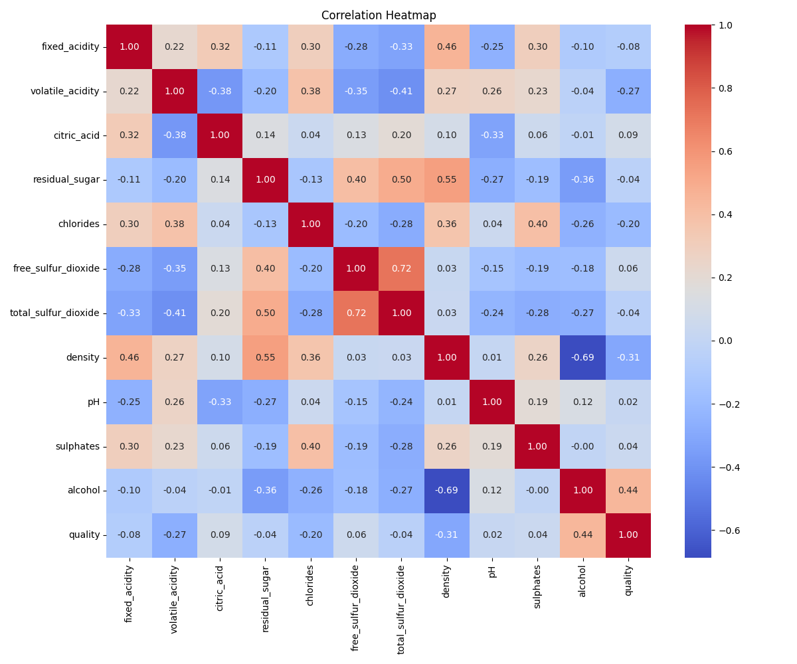

Figure 4: Correlation Heatmap for the Features

## Data Preprocessing

The dataset contains no missing values, thus no methods to address missing data were necessary. However, the dataset lacks samples in class labels 0, 1, 2, and 10, so our model could not predict any of these classes. Additionally, class labels 3, 4, 8, and 9 have relatively low representation compared to the other classes, indicating class imbalance.

Since all the features are numerical, we normalized them to the same scale. Normalization is required since we used various clustering methods requiring normalized numerical features. Given that the dataset contains only 11 features, dimensionality reduction techniques were deemed unnecessary during data preprocessing.

To address the class imbalance present in the dataset, we applied the Synthetic Minority Oversampling Technique (SMOTE) to generate synthetic samples for underrepresented classes. After SMOTE was performed, the dataset contains 15,673 samples.

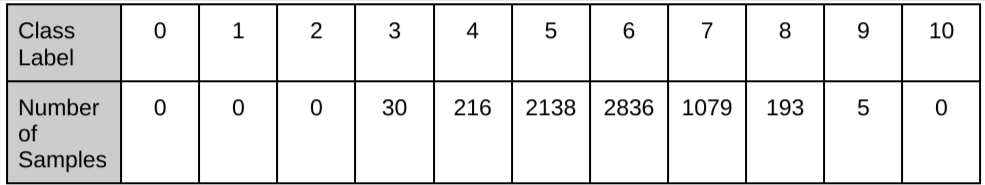

Figure 5: Class Distribution in the Original Dataset

## Outlier Detection

Outlier detection was performed to identify and remove samples that could negatively impact classification results. **Local Outlier Factor (LOF)**, **Isolation Forest (IF)**, and **Elliptic Envelope (EE)** were used as the outlier detection methods:

1. **LOF**: LOF was chosen due to its strength with smaller datasets and capturing local density variations. If LOF is used to remove outliers, the dataset would contain 13,952 samples.
2. **IF**: IF was chosen due to its strength in handling imbalanced datasets. If IF is used to remove outliers, the dataset would contain 13,842 samples.
3. **EE**: EE was chosen due to all the features in the dataset being numerical. If EE is used to remove outliers, the dataset would contain 14,105 samples.

Principal Component Analysis (PCA) was applied to reduce the dataset’s dimensionality to two components after the outlier detection methods were performed. This allowed for a scatterplot to be created to visualize which samples were outliers. Subsequently, samples identified as outliers were removed from the dataset.

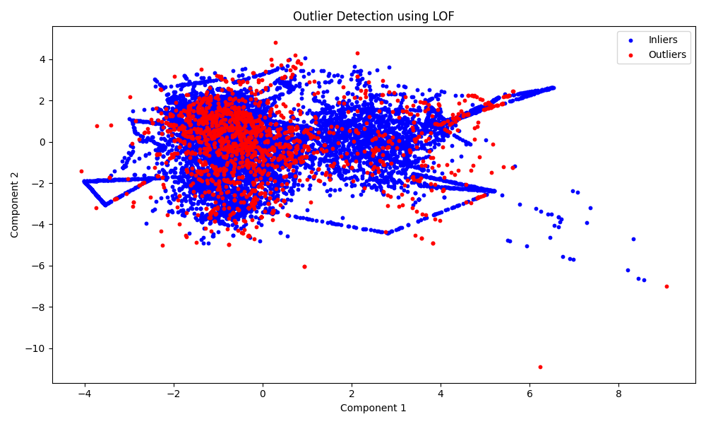

Figure 6: Outlier Plot for LOF

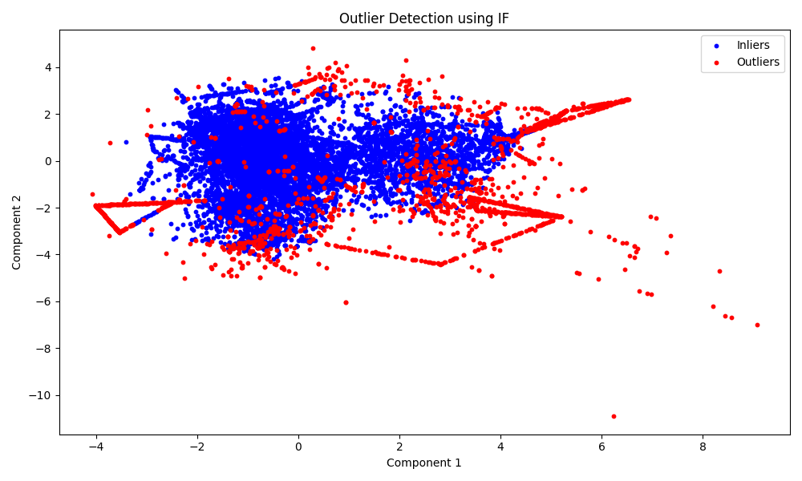

Figure 7: Outlier Plot for IF

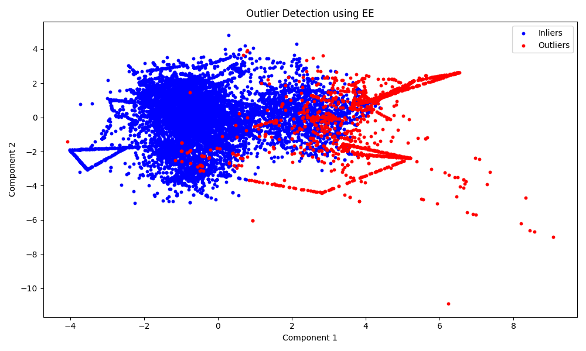

Figure 8: Outlier Plot for EE

## Clustering

The clustering process revealed patterns in wine characteristics by grouping wines based on chemical properties. We used three clustering algorithms (**K-Means**, **Hierarchical Clustering**, and **DBSCAN**) to identify these patterns. We also used dimensionality reduction techniques to visualize clusters in 2D space effectively. The clustering process on the Wine Quality dataset revealed patterns in wine characteristics based on chemical properties. By analyzing clusters, we saw that wines with similar quality scores tend to form distinct groups, highlighting the importance of factors like acidity, alcohol content, and sulphur levels in determining wine quality.

Here’s a step-by-step explanation of the approach:

1. **Dimensionality Reduction for Visualization**:
   - **PCA** with two components was used for K-Means and Hierarchical Clustering to capture linear relationships.
   - **t-SNE** (t-distributed Stochastic Neighbor Embedding) was used for DBSCAN due to its ability to capture non-linear relationships, making it better suited for density-based clustering visualization.
2. **Algorithm Selection and Evaluation Metrics**:
   - **K-Means**: Evaluated using the **Silhouette Score**, which measures how similar data points are to their own cluster compared to other clusters. A good Silhouette Score ranges between **0.3 (moderate separation)** and **1.0 (perfect separation)**. Negative or near-zero scores indicate poor clustering.
   - **Hierarchical Clustering**: Evaluated with the **Calinski-Harabasz Index**, which measures the ratio of intra-cluster dispersion to inter-cluster separation. Higher values indicate better-defined clusters. A "good" Calinski-Harabasz score is dataset-dependent, but higher scores generally suggest compact and well-separated clusters.
   - **DBSCAN**: Evaluated using the **Davies-Bouldin Index**, which measures the average ratio of intra-cluster spread to inter-cluster separation. A lower score (closer to **0**) indicates better clustering. Scores above **1.0** suggest overlapping or poorly defined clusters.
3. **Hyperparameter Tuning**:
   - **K-Means and Hierarchical Clustering**: Tuned the number of clusters (2 to 10) using grid search. For each outlier detection method, the best cluster count was applied.
   - **DBSCAN**: Tuned eps (neighborhood radius) and min_samples (minimum points in a cluster). A smaller eps was needed for datasets with tighter clusters, which sometimes led to noise points.

We performed clustering after applying outlier detection and feature selection. Since we applied three different outlier detection methods (more on this in the outlier detection section), as mentioned before, hyperparameter tuning was done for each outlier detection method. This tuning code is included in main.py as a comment as the process is computationally intensive. However, the best parameters identified during tuning have been applied in the final analysis. The table below summarizes the evaluation metrics for each algorithm across outlier detection methods:

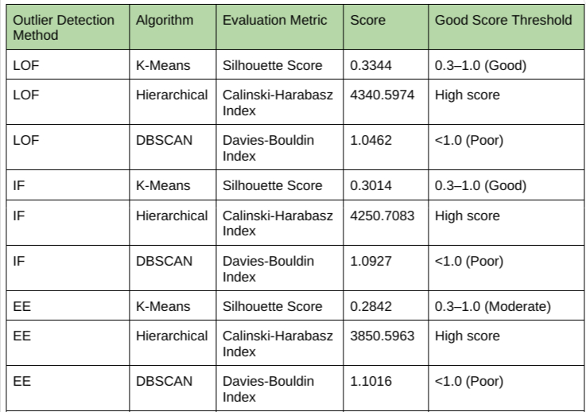

Figure 9: Clustering Algorithm Scores

**Observations**

1. **K-Means**:
   - With two or three clusters (depending on the outlier detection method), K-Means minimized intra-cluster variance, grouping wines based on similar chemical characteristics.
   - Achieved Silhouette Scores in the moderate range (0.28–0.33) across all outlier detection methods, suggesting decent cluster separability.
   - LOF yielded the best performance for K-Means clustering, achieving the highest Silhouette Score of 0.3344.
2. **Hierarchical Clustering**:
   - Using Agglomerative Clustering with two or three clusters (depending on the outlier detection method), we observed slightly different grouping patterns, emphasizing relationships based on pairwise distances.
   - Produced the highest Calinski-Harabasz Index values across all methods, with LOF yielding the best score of 4340.5947.
   - This indicates compact and well-separated clusters, especially when LOF outlier detection was applied.
3. **DBSCAN**:
   - Grouping data points based on density with two minimum samples.
   - Struggled with this dataset, with Davies-Bouldin Index values exceeding the ideal threshold of 1.0, indicating poor clustering quality.
   - This can be attributed to overlapping data distributions and limited density variation in the Wine Quality dataset, which do not align well with DBSCAN's assumptions.

As mentioned before, to optimize the clustering performance, hyperparameter tuning was performed:

- **K-Means**: The number of clusters was tuned in the range of 2 to 10.
- **Hierarchical Clustering**: The number of clusters was also tuned in the range of 2 to 10.
- **DBSCAN**: Parameters eps (the radius for the neighborhood) and min_samples (minimum points in a cluster) were tuned using grid search.

The following figures show the clustering results with different outlier detection methods:

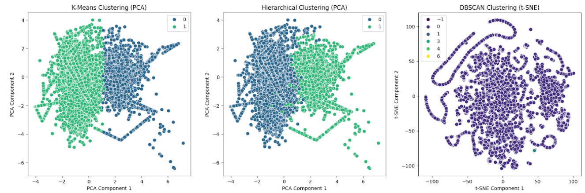

Figure 10: Clustering results with MI-selected features after outlier removal (LOF algorithm). The scatterplots display clusters formed by K-Means, Hierarchical Clustering, and DBSCAN, using PCA and t-SNE, respectively.

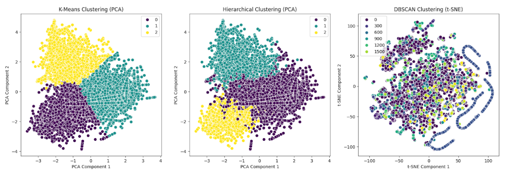

Figure 11: Clustering results with MI-selected features after outlier removal (IF algorithm). The scatterplots display clusters formed by K-Means, Hierarchical Clustering, and DBSCAN, using PCA and t-SNE, respectively.

Figure 12: Clustering results with MI-selected features after outlier removal (EE algorithm). The scatterplots display clusters formed by K-Means, Hierarchical Clustering, and DBSCAN, using PCA and t-SNE, respectively.

As you can see DBSCAN constantly struggles with clustering. This may be due to several different reasons such as: overlapping clusters, varying densities, or lacking a clear density separation between groups. This is because DBSCAN relies heavily on density-based assumptions to form clusters.

## Feature Selection

Feature selection highlighted the key factors contributing to wine quality, emphasizing the importance of features like alcohol content and chlorides. Reducing dimensionality helped in isolating these impactful characteristics, which supports more efficient and interpretable clustering and classification.

We experimented with multiple feature selection methods, ultimately selecting **Mutual Information** as the most effective. Here’s a breakdown of the process:

1. **Recursive Feature Elimination (RFE)**: RFE iteratively removed less significant features, but the process was computationally intensive and did not yield significant gains.
2. **Lasso Regression**: Although Lasso penalized less relevant features, it did not consistently select features relevant to wine quality prediction.
3. **Mutual Information**: This technique, which measures the dependency between each feature and the target, identified a set of features that had the highest predictive power, improving both model accuracy and computational efficiency.

By comparing models with and without feature selection, we found that Mutual Information reduced the feature set without sacrificing accuracy, confirming the relevance of selected features.

Below is a bar chart displaying the top 10 features:

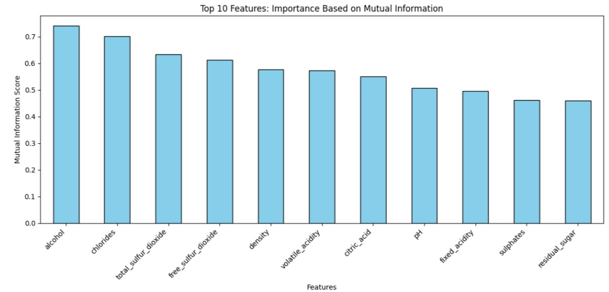

Figure 13: Mutual Information Score for the Top 10 Features

Here's a breakdown of the three most critical features for determining wine quality:

1. **Alcohol**: This is the most important feature, with the highest Mutual Information score. Alcohol content strongly correlates with wine quality, as it influences the flavor profile and overall sensory experience.
2. **Chlorides**: The second most significant feature, chlorides (salinity) affect the taste balance. Excessive chlorides may negatively impact wine quality.
3. **Total Sulfur Dioxide**: This preservative affects wine's freshness and stability. While it prevents oxidation, excessive amounts can be detrimental to quality.

## Classification

The machine learning classifiers are used to predict wine quality from physicochemical properties. Stratified sampling is used to split the dataset into training test sets since the class distribution of wine quality ratings is imbalanced. We use an 80-20 split with a fixed random state for reproducibility. Three classifiers are defined: It also involves the use of Random Forest, Support Vector Machine (SVM) and k-nearest Neighbors (k-NN).

The classifiers are evaluated using five-fold stratified K-fold cross-validation with training on four folds and testing on one fold per iteration. We train the models on the training set and predict on the test set. Accuracy, precision, recall, F1-score, and ROC AUC score were calculated as performance metrics.

Since wine quality ratings are multi-class labels we binarize to get the ROC AUC score for the One vs One strategy. The performance of classifiers is visualized with confusion matrices and ROC curves for each classifier. All results, such as cross-validation score, test metric and prediction probability are stored in the results dictionary to be further used. Thus, the classifiers can be compared to see which one fits the dataset more.

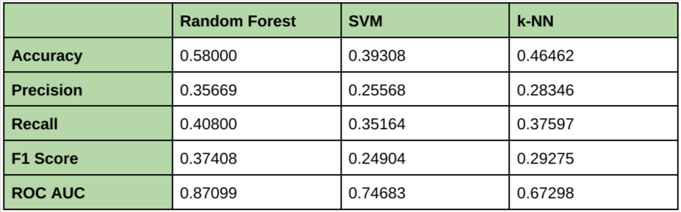

Figure 14: Performance Metrics for LOF

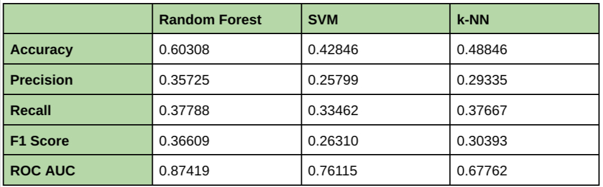

Figure 15: Performance Metrics for IF

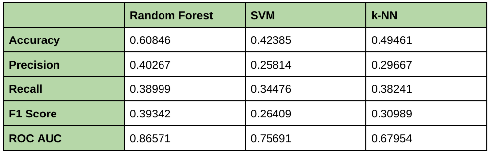

Figure 16: Performance Metrics for EE

Thus, since EE provided the best performance compared to the other outlier detection techniques, we will merge this method into classifier performance analysis, mainly looking at confusion matrices and ROC curves to assess the effect it would create. For enhanced context around the EE outlier detection, we present here confusion matrices and ROC curves for k-NN, Random Forest, and SVM classifiers with EE as their feature extraction component.

The performance of the classifiers was improved using EE's outlier detection capabilities, particularly to refine the classifier's predictions. Random Forest emerged as the top-performing classifier with consistently high AUC scores (e.g., Class 5: We obtain robust predictions on all classes (AUC=0.9)). This shows that noise was excluded and reduced by EE and that Random Forest can generalize better after EE. Random Forest worked well, and SVM had a fairly good performance, but of course, lagged in some classes. However, k-NN was more prone to remain noise or anomalies in class 0 (AUC = 0.58), and struggled more with other classes, especially using only the algorithm (AUC = 0.68).

Random Forest improved significantly in predicting 'the High,' 'Medium,' and 'Low' categories after applying EE and then hyperparameter tuning. This demonstrates the robustness and synergy of Random Forest with the EE outlier detection method. The fact that such high predictive accuracy and model reliability can be achieved through strong outlier detection techniques like EE paired with strong classifiers guides us toward including them.

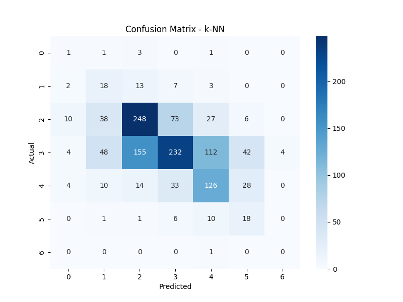

Figure 17: k-NN Confusion Matrix

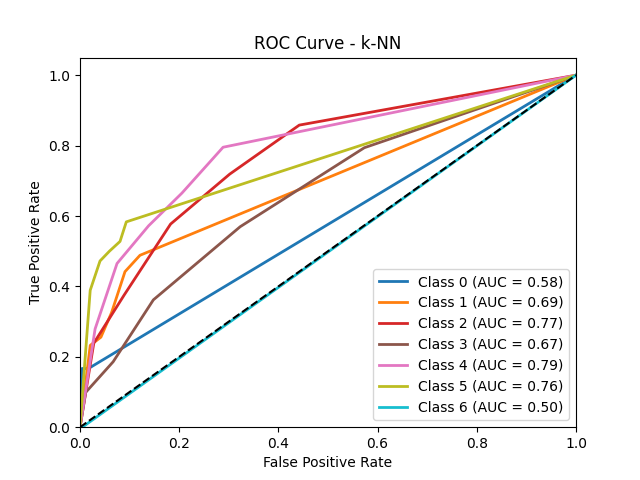

Figure 18: k-NN ROC Curve

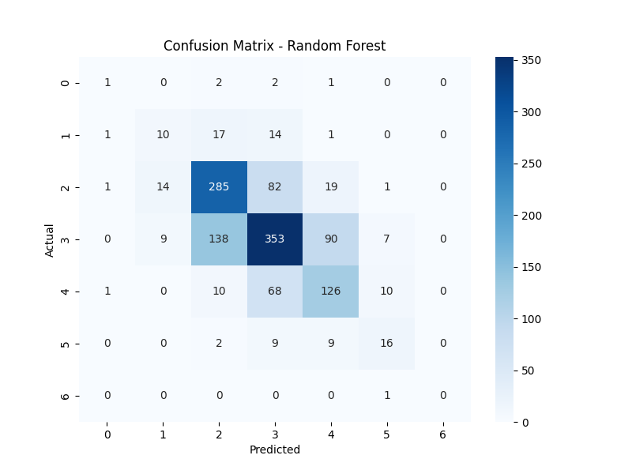

Figure 19: Random Forest Confusion Matrix

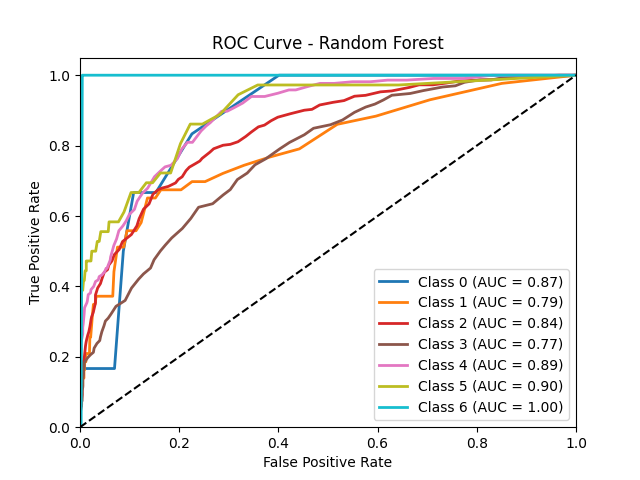

Figure 20: Random Forest ROC Curve

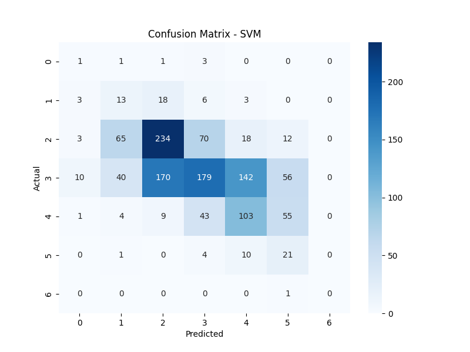

Figure 21: SVM Confusion Matrix

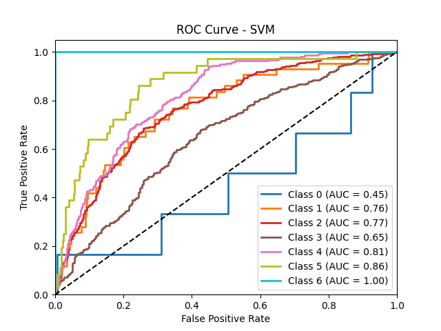

Figure 22: SVM ROC Curve

## Hyperparameter Tuning

For hyperparameter tuning, Random Search was used since Grid Search is computationally expensive. The following parameters were used for random search:

- n_estimators: [50, 100, 200, 400, 800]
- max_depth: [None, 10, 20, 50, 100]
- min_samples_split: [2, 5, 10, 20]
- min_samples_leaf: [1, 2, 4, 10]

The parameters that gave the best results for all three outlier detection methods are when n_estimators is 800, min_samples_split is 5, min_samples_leaf is 1, and max_depth is 100. We applied hyperparameter tuning to the Random Forest classification algorithm since it was the method that provided the highest performance across all metrics: accuracy, precision, recall, F1 score, and ROC AUC. The tuned hyperparameters resulted in only menial performance improvements. The specific impacts of the tuning are detailed in the tables below.

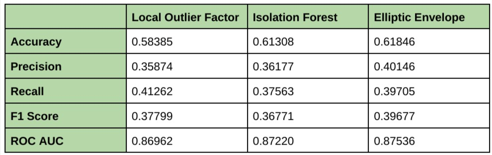

Figure 23: Random Forest Hyperparameter Tuning Classification Results

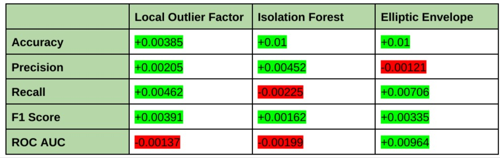

Figure 24: Difference in Random Forest vs. Random Forest Hyperparameter Tuning

## Conclusion

The clustering analysis on the Wine Quality dataset revealed patterns in wine characteristics by grouping wines based on chemical properties. Using K-Means, Hierarchical Clustering, and DBSCAN, we observed that wines with similar quality scores tend to cluster together, highlighting the influence of factors like acidity, alcohol content, and sulphur levels. Dimensionality reduction techniques, such as PCA and t-SNE, helped us with the visualization of clusters. K-Means and Hierarchical Clustering generally performed well as indicated by the highest Silhouette and Calinski-Harabasz scores. However, DBSCAN consistently struggled to identify distinct clusters due to overlapping distributions and limited density variation in the dataset, as reflected in its Davies-Bouldin Index scores.

Feature selection identified alcohol content, chlorides, and total sulfur dioxide as the top three most important factors influencing wine quality. Alcohol content had the strongest predictive power, as it directly impacts the sensory profile and overall quality of wine. Chlorides, which affect the salinity and balance, and total sulfur dioxide, which preserves freshness and stability, were also key contributors. Using Mutual Information for feature selection allowed us to isolate these impactful characteristics, reducing the dimensionality of the dataset without sacrificing accuracy. This not only improved model efficiency but also enhanced interpretability, supporting more effective clustering and classification.

SMOTE and the outlier removal methods mitigated the problem of class imbalance and noise respectively, and have made our project effective in wine quality classification. We found that by using feature selection and hyperparameter tuning, the Random Forest classifier achieved the best results in all performance metrics compared to the other classifiers. Of the three outlier detection methods, EE gave the best accuracy, precision, and F1 score, while LOF provided the best recall, and IF provided the highest ROC AUC score.

The limitations of our models are mainly due to the limitations of the dataset. There were two main limitations in our dataset. First is the lack of samples for class labels 0, 1, 2, and 10, preventing our models from making predictions for these classes. The second limitation is the significantly imbalanced dataset, impacting our models to generalize across all quality levels.

For future reports, the primary improvement would be the quantity and quality of the samples in the dataset. Currently, our dataset only contains 6497 samples, which limits the model’s ability to generalize effectively. Increasing the number of samples would provide more representation of the data. Additionally, missing and underrepresented classes negatively impact the accuracy the model can achieve. Collecting more data for these classes would improve model training and evaluation.
